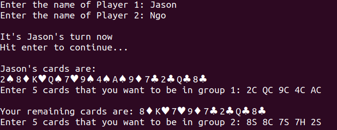

# Chinese Poker
A terminal-based Chinese Poker card game for two people.

This game is based on poker hand rankings. It is intended a beginner-friendly game, as only a basic knowledge of poker hand rankings is needed to get started. See rules below.

## Getting Started
First, make sure you have either `Python 2` or `Python 3` installed on your machine.

Now, clone the repository with the command

```
$ git clone https://github.com/ngojason9/Chinese-Poker
```
Open the directory and run in the terminal `python chinese_poker.py`.

*Screenshot:*


**Note**: When typing the cards you want to be in your hands, each card’s rank is followed by suit (case insensitive), and then a white space.


## Rules for Chinese Poker
1. Chinese Poker is a card game based on poker hand rankings. You can farmiliarize yourself with poker rankings [here](https://en.wikipedia.org/wiki/List_of_poker_hands#Hand-ranking_categories).

2. There are 2 players; each player receives 13 cards.

3. Players then arrange their hand into three different groups: two five card poker hands, and one three card poker hand.
   
   *Note: Straight and flushes don’t count in the three card hand, only high card, pairs and triples.*

4. Once each player has set her hands, she compares each of the three hands with the opponent’s corresponding hands.
5. Whether a player wins a hand is based on poker rankings. Since there are three hands in total, the player who wins at least two out of three hands wins the game.